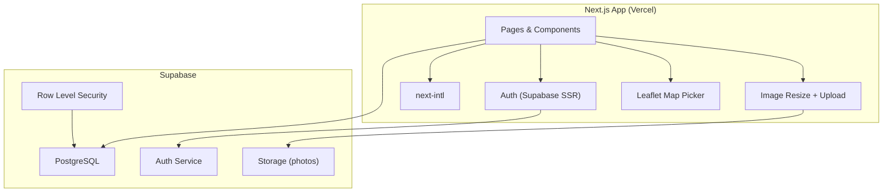
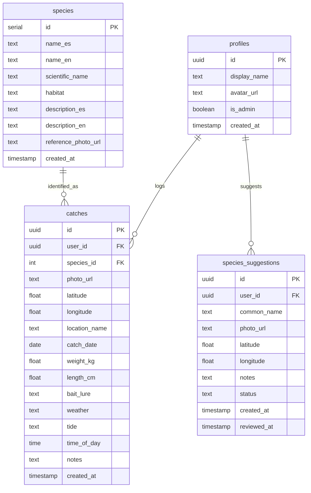

# Go Pesca MVP - Plan

## Goal Capsule

- **Objective:** Build a web app where fishermen register their catches and build a personal Pokedex of fish species from Costa Rica, starting with a curated catalog of ~40 common species.
- **Product authority:** Kevin Santamaria (solo developer & product owner)
- **Open blockers:** None
- **Execution profile:** Greenfield Next.js + Supabase project. 8 implementation units, dependency-ordered.
- **Tail ownership:** Developer ships when all units pass verification and Definition of Done criteria are met.

---

## Product Contract

### Summary

Go Pesca is a bilingual (es/en) web app for recreational fishermen in Costa Rica. Users register catches — photo, species, location, date, and optional details — and build a personal Pokedex tracking which species they've caught. The MVP is personal-only (no social features) with a curated catalog of ~40 species that grows through user suggestions.

### Problem

Fishermen have no simple, dedicated tool to log catches and track species over time. Existing solutions are generic note-taking apps or complex tournament platforms. There's no collection-driven experience that makes logging catches rewarding and motivates anglers to discover new species.

### Target User

Recreational fishermen in Costa Rica (freshwater and saltwater) who want to track and showcase their catches. Initially Spanish-speaking, with English support for visiting anglers and broader reach.

### Requirements

**Authentication & Profile**

- R1. Users register and log in via email/password using Supabase Auth.
- R2. Users have a profile with display name and avatar.
- R3. Social auth (Google) is a stretch goal, not required for MVP.

**Species Catalog**

- R4. The app ships with a pre-curated catalog of ~40 common Costa Rica species (freshwater + saltwater).
- R5. Each species entry contains: common name (es/en), scientific name, reference photo, habitat type (freshwater/saltwater/brackish), and brief description.
- R6. Users can search and filter species by name and habitat type.
- R7. Only admins can add or edit species in the catalog.

**Catch Logging**

- R8. Users log a catch with required fields: photo, species (from catalog), location (map pin), and date.
- R9. Users can optionally add: weight, length, bait/lure, weather, tide, time of day, and free-text notes.
- R10. Photos are uploaded to Supabase Storage and resized client-side before upload.

**Personal Pokedex**

- R11. The Pokedex displays all catalog species in a grid: caught species show the user's photo and stats; uncaught species show as locked/silhouette cards.
- R12. A progress indicator shows "X/N species caught."
- R13. Species detail view shows all catches of that species with photos, locations, dates, and aggregate stats.
- R14. Users can sort/filter the Pokedex by caught/uncaught, habitat type, and catch count.

**Catch History**

- R15. Users see a chronological list of all their catches with photo thumbnail, species, location, and date.
- R16. Users can tap a catch to view full details.
- R17. Users can filter catches by species, date range, and location.

**Species Suggestions**

- R18. Users can suggest a new species not in the catalog, providing common name, photo, location, and notes.
- R19. Suggestions go to a review queue visible to admins.
- R20. Users are notified when their suggestion is approved.

**Internationalization**

- R21. The UI is available in Spanish (default) and English.
- R22. A language switcher is accessible from the header.
- R23. Species names are displayed in both languages.

**Data Isolation**

- R24. All user data is isolated via Supabase Row Level Security — users see only their own catches and suggestions.

### Key Decisions

- **Catalog-based species selection** over free text — prevents duplicates, enables consistent Pokedex tracking. Governs R8, R11.
- **Base catalog + growth** — launch with ~40 species; users suggest new ones rather than requiring a complete catalog upfront. Governs R4, R18.
- **MVP is personal only** — no social features in v1; architecture does not preclude adding them later.
- **Bilingual UI (es/en)** — internationalization from day one. Governs R21, R22, R23.
- **Web first** — Next.js web app; mobile is a future phase.

### Acceptance Criteria

- AE1. A new user registers, logs in, and sees a Pokedex with ~40 locked species. Covers R1, R4, R11.
- AE2. A user logs a catch with photo, species, location, and date — the species unlocks in their Pokedex. Covers R8, R10, R11.
- AE3. A user browses their Pokedex, sees progress (X/40), and views all catches per species. Covers R12, R13, R14.
- AE4. A user views their chronological catch history. Covers R15, R16.
- AE5. A user suggests a new species not in the catalog. Covers R18.
- AE6. The UI works in both Spanish and English. Covers R21, R22.
- AE7. Users only see their own catches — data is isolated via RLS. Covers R24.

### Scope Boundaries

#### Deferred for Later

- Social features: public profiles, feed, comments, likes, rankings
- AI-powered species recognition from photos
- Mobile app (React Native / Expo)
- Map view of fishing spots with community data
- Badges, achievements, gamification
- Advanced personal analytics and seasonal trends

### Outstanding Questions

- What specific ~40 species should be in the initial catalog? (Deferred — research during U4 implementation)
- Notification mechanism for approved suggestions (R20) — email, in-app, or both? (Deferred — simplest approach in MVP: in-app flag on next login)

---

## Planning Contract

### Key Technical Decisions

- KTD1. **Next.js App Router with `src/` directory** — standard project structure using App Router for server components and file-based routing. `src/app/[locale]/` for i18n routing.
- KTD2. **Supabase client via `@supabase/ssr`** — server-side and client-side Supabase clients using the official SSR package for cookie-based auth in Next.js.
- KTD3. **Leaflet for location picker** — lighter than Mapbox, no API key required for MVP. OpenStreetMap tiles. GPS auto-detect with manual pin adjustment.
- KTD4. **Metric default for measurements** — weight in kg, length in cm. Users toggle per field when logging (no settings page for MVP).
- KTD5. **Client-side image resize before upload** — using browser Canvas API to resize photos to max 1200px before uploading to Supabase Storage. Reduces storage costs and upload time.
- KTD6. **Species seed data as JSON** — a `seed/species.json` file with ~40 species loaded via a Supabase SQL migration or seed script.
- KTD7. **Admin via `is_admin` column on profiles** — no admin panel for MVP. Admins manage species and review suggestions directly through Supabase dashboard. RLS policies enforce admin-only writes on species table.
- KTD8. **next-intl for i18n** — handles locale routing (`/es/...`, `/en/...`), message catalogs, and server/client component translation.

### High-Level Technical Design

### Assumptions

- Supabase free tier is sufficient for MVP (500MB database, 1GB storage, 50K monthly active users).
- OpenStreetMap tiles are acceptable quality for the location picker.
- ~40 species can be researched and seeded within implementation of U4.

---

## Implementation Units

### U1. Project scaffolding and configuration

- **Goal:** Initialize the Next.js project with all foundational tooling configured and a deployable skeleton.
- **Requirements:** Foundation for all subsequent units.
- **Dependencies:** None
- **Files:**
  - `package.json`
  - `tsconfig.json`
  - `tailwind.config.ts`
  - `next.config.ts`
  - `src/app/layout.tsx`
  - `src/app/[locale]/layout.tsx`
  - `src/app/[locale]/page.tsx`
  - `src/i18n/request.ts`
  - `src/i18n/routing.ts`
  - `src/messages/en.json`
  - `src/messages/es.json`
  - `src/middleware.ts`
  - `.env.local.example`
- **Approach:** Scaffold with `create-next-app` using App Router and TypeScript. Configure Tailwind CSS. Set up next-intl with `[locale]` dynamic segment and middleware for locale detection. Create `.env.local.example` with Supabase URL and anon key placeholders.
- **Patterns to follow:** Next.js 14+ App Router conventions, next-intl App Router setup docs.
- **Test scenarios:**
  - Dev server starts without errors on `npm run dev`
  - Navigating to `/es` renders Spanish placeholder content
  - Navigating to `/en` renders English placeholder content
  - Root `/` redirects to default locale `/es`
- **Verification:** The app runs locally, serves both locales, and deploys to Vercel without errors.

---

### U2. Database schema, Supabase client, and RLS policies

- **Goal:** Create the database schema, configure Supabase client utilities, and enforce data isolation via RLS.
- **Requirements:** R24, foundation for R1, R4, R8, R18.
- **Dependencies:** U1
- **Files:**
  - `supabase/migrations/001_initial_schema.sql`
  - `src/lib/supabase/client.ts`
  - `src/lib/supabase/server.ts`
  - `src/lib/supabase/middleware.ts`
  - `src/lib/database.types.ts`
- **Approach:** Create SQL migration with `profiles`, `species`, `catches`, and `species_suggestions` tables per the ER diagram. Enable RLS on all tables. Policies: users read all species; users CRUD own catches and suggestions; admins write species and update suggestion status. Supabase client setup via `@supabase/ssr` with cookie-based session for server components and middleware.
- **Patterns to follow:** Supabase SSR docs for Next.js App Router, `@supabase/ssr` `createServerClient` / `createBrowserClient` patterns.
- **Test scenarios:**
  - Migration applies cleanly to a fresh Supabase project
  - RLS blocks user A from reading user B's catches
  - RLS allows any authenticated user to read all species
  - RLS blocks non-admin users from inserting into species table
  - Supabase client connects successfully from both server and client components
- **Verification:** `supabase db push` succeeds. Manually verify RLS policies in Supabase dashboard SQL editor.

---

### U3. Authentication flow

- **Goal:** Implement registration, login, logout, and profile creation with Supabase Auth.
- **Requirements:** R1, R2.
- **Dependencies:** U2
- **Files:**
  - `src/app/[locale]/auth/login/page.tsx`
  - `src/app/[locale]/auth/register/page.tsx`
  - `src/app/[locale]/auth/callback/route.ts`
  - `src/components/auth/login-form.tsx`
  - `src/components/auth/register-form.tsx`
  - `src/components/layout/header.tsx`
  - `src/components/layout/user-menu.tsx`
  - `src/lib/auth.ts`
  - `src/middleware.ts` (update)
- **Approach:** Email/password auth via Supabase `signUp` / `signInWithPassword`. Auth callback route handles email confirmation redirect. On registration, create a `profiles` row via a Supabase database trigger (`on auth.users insert`). Middleware checks session and redirects unauthenticated users from protected routes. Header shows user menu when logged in, login/register links when not.
- **Patterns to follow:** Supabase Auth + Next.js App Router guide, `@supabase/ssr` middleware pattern.
- **Test scenarios:**
  - User registers with email/password and receives confirmation
  - User logs in with valid credentials and is redirected to home
  - Invalid credentials show an error message
  - Logged-in user sees their display name in the header
  - Logged-out user is redirected to login when accessing protected routes
  - User can log out and is redirected to home
  - Profile row is created automatically on registration
- **Verification:** Full registration → login → protected page → logout flow works end-to-end in the browser.

---

### U4. Species catalog and seed data

- **Goal:** Populate the species catalog with ~40 Costa Rica species and build the catalog browsing UI.
- **Requirements:** R4, R5, R6, R7, R23.
- **Dependencies:** U2, U3
- **Files:**
  - `seed/species.json`
  - `supabase/migrations/002_seed_species.sql`
  - `src/app/[locale]/species/page.tsx`
  - `src/app/[locale]/species/[id]/page.tsx`
  - `src/components/species/species-grid.tsx`
  - `src/components/species/species-card.tsx`
  - `src/components/species/species-filter.tsx`
  - `src/components/species/species-search.tsx`
- **Approach:** Research and compile ~40 common Costa Rica species (dorado, guapote, robalo, pargo, marlin, etc.) into `seed/species.json` with bilingual names, scientific names, habitat types, and descriptions. Convert to SQL insert migration. Build a grid page with search (by name in current locale) and filter (by habitat type). Species detail page shows reference photo, all fields, and bilingual names. Server components for initial data fetch.
- **Patterns to follow:** Next.js server components for data fetching, Supabase `select` queries with filters.
- **Test scenarios:**
  - Seed migration inserts ~40 species with complete bilingual data
  - Species grid page renders all species as cards
  - Searching "guapote" filters to matching species
  - Filtering by "freshwater" shows only freshwater species
  - Species detail page shows all fields in the current locale
  - Switching locale changes species names and descriptions
- **Verification:** Species catalog page loads with ~40 species, search and filter work correctly, species detail page renders all fields.

---

### U5. Catch logging with photo upload and location picker

- **Goal:** Implement the catch registration form with photo upload, species picker, map-based location selection, and all required/optional fields.
- **Requirements:** R8, R9, R10.
- **Dependencies:** U2, U3, U4
- **Files:**
  - `src/app/[locale]/catches/new/page.tsx`
  - `src/components/catches/catch-form.tsx`
  - `src/components/catches/species-picker.tsx`
  - `src/components/catches/location-picker.tsx`
  - `src/components/catches/photo-upload.tsx`
  - `src/lib/image-utils.ts`
  - `src/lib/catches.ts`
- **Approach:** Multi-section form with: (1) Photo upload — client-side resize to max 1200px via Canvas API, preview before upload, upload to Supabase Storage `catches/` bucket. (2) Species picker — searchable dropdown populated from species table. (3) Location picker — Leaflet map with GPS auto-detect (`navigator.geolocation`) and draggable pin, plus optional location name text field. (4) Date picker — defaults to today. (5) Optional fields section — collapsible, with weight (kg), length (cm), bait/lure, weather, tide, time, and notes. Form submission inserts into `catches` table and redirects to catch detail or Pokedex.
- **Patterns to follow:** React state for form, Supabase Storage upload API, Leaflet React wrapper (`react-leaflet`).
- **Test scenarios:**
  - Photo uploads successfully and shows preview before submission
  - Large photos are resized to max 1200px width before upload
  - Species picker search filters the species list
  - Map loads with GPS position when permission is granted
  - Map loads with default Costa Rica center when GPS is denied
  - User can drag pin to select a different location
  - Form submission with required fields only succeeds
  - Form submission with all optional fields succeeds
  - Form submission without required fields shows validation errors
  - Catch appears in the database with correct user_id after submission
- **Verification:** Log a catch end-to-end: upload photo, pick species, set location, submit. Verify the row exists in Supabase with correct data and the photo is in Storage.

---

### U6. Personal Pokedex view

- **Goal:** Build the Pokedex grid showing caught vs uncaught species, progress tracking, and species detail with catch history.
- **Requirements:** R11, R12, R13, R14.
- **Dependencies:** U4, U5
- **Files:**
  - `src/app/[locale]/pokedex/page.tsx`
  - `src/app/[locale]/pokedex/[speciesId]/page.tsx`
  - `src/components/pokedex/pokedex-grid.tsx`
  - `src/components/pokedex/pokedex-card.tsx`
  - `src/components/pokedex/progress-bar.tsx`
  - `src/components/pokedex/species-catches.tsx`
  - `src/lib/pokedex.ts`
- **Approach:** Fetch all species + user's catches (grouped by species_id with count, first/last date). Render grid: caught species show user's first catch photo, catch count, and first catch date; uncaught species show a grayed-out silhouette with species name. Progress bar at top: "12/40 species caught." Filters: caught/uncaught toggle, habitat type dropdown, sort by catch count. Species detail page: reference info + all user catches of that species in a timeline with photos and details. Query uses a left join of species with user catches aggregated.
- **Patterns to follow:** Supabase aggregate queries, Next.js dynamic routes.
- **Test scenarios:**
  - Pokedex shows all ~40 species in a grid
  - Species with catches display as "unlocked" with user's photo
  - Species without catches display as "locked" with silhouette/gray styling
  - Progress bar shows correct count (e.g., "3/40 species caught")
  - Filtering by "caught" shows only unlocked species
  - Filtering by habitat type narrows the grid
  - Species detail page shows all catches of that species with photos
  - Species detail page shows aggregate stats (total catches, first/last date)
  - Empty state: new user sees all species locked with "0/40" progress
- **Verification:** Register a few catches for different species, verify the Pokedex reflects the correct state (caught/uncaught), progress count, and species detail catches.

---

### U7. Catch history page

- **Goal:** Build a chronological catch history with filtering.
- **Requirements:** R15, R16, R17.
- **Dependencies:** U5
- **Files:**
  - `src/app/[locale]/catches/page.tsx`
  - `src/app/[locale]/catches/[id]/page.tsx`
  - `src/components/catches/catch-list.tsx`
  - `src/components/catches/catch-card.tsx`
  - `src/components/catches/catch-filters.tsx`
  - `src/components/catches/catch-detail.tsx`
- **Approach:** List page fetches user's catches ordered by `catch_date DESC` with species name joined. Each entry shows photo thumbnail, species name, location name, and date. Filters: species dropdown, date range picker, location text search. Catch detail page shows full info including all optional fields, large photo, and map with pin at the catch location (read-only Leaflet map). Pagination or infinite scroll for long lists.
- **Patterns to follow:** Supabase `select` with joins and filters, Next.js server components for initial load.
- **Test scenarios:**
  - Catch history shows all user catches in reverse chronological order
  - Each entry displays photo thumbnail, species name, location, and date
  - Filtering by species shows only catches of that species
  - Filtering by date range narrows the list
  - Catch detail page shows all fields including optional ones
  - Catch detail page shows a read-only map with the catch location pinned
  - Empty state message when user has no catches
- **Verification:** Log several catches across different dates and species, verify the list, filters, and detail pages display correctly.

---

### U8. Species suggestion flow

- **Goal:** Allow users to suggest new species and provide admin visibility into suggestions.
- **Requirements:** R18, R19, R20.
- **Dependencies:** U3, U5
- **Files:**
  - `src/app/[locale]/species/suggest/page.tsx`
  - `src/components/species/suggestion-form.tsx`
  - `src/app/[locale]/admin/suggestions/page.tsx`
  - `src/components/admin/suggestion-list.tsx`
  - `src/components/admin/suggestion-review.tsx`
  - `src/lib/suggestions.ts`
- **Approach:** Suggestion form: common name, photo upload (reuse photo-upload component), location (optional, reuse location-picker), and notes. Inserts into `species_suggestions` with `status: 'pending'`. Admin suggestions page (protected by `is_admin` check): list of pending suggestions with approve/reject actions. Approve creates a new species row and updates suggestion status to `approved`. User notification: on next login or Pokedex visit, show a banner if any of their suggestions were approved since last check (simple `reviewed_at > last_seen` query).
- **Patterns to follow:** Reuse photo-upload and location-picker components from U5.
- **Test scenarios:**
  - User submits a species suggestion with all fields
  - Suggestion appears in admin review page with status "pending"
  - Non-admin users cannot access the admin suggestions page
  - Admin approves a suggestion — new species appears in the catalog
  - Admin rejects a suggestion — status updates to "rejected"
  - User sees a notification banner when their suggestion was approved
  - Suggestion form validates that common name is required
- **Verification:** Submit a suggestion as a regular user, approve it as an admin, verify the new species appears in the catalog and the user sees a notification.

---

## Verification Contract

| Gate | Command / Check | Applies to |
|---|---|---|
| Dev server | `npm run dev` — no errors, pages load | All units |
| TypeScript | `npx tsc --noEmit` — no type errors | All units |
| Lint | `npm run lint` — no warnings | All units |
| Build | `npm run build` — production build succeeds | All units |
| RLS | Manual SQL verification in Supabase dashboard | U2 |
| Auth flow | Manual end-to-end test in browser | U3 |
| Seed data | Verify ~40 species loaded with complete bilingual data | U4 |
| Catch flow | Log a catch end-to-end with photo, species, location | U5 |
| Pokedex state | Verify caught/uncaught rendering and progress count | U6 |
| i18n | Toggle locale and verify all visible text switches | U1, U4, U6, U7 |

---

## Definition of Done

- All 8 implementation units are complete and pass their verification criteria
- TypeScript compiles with no errors (`npx tsc --noEmit`)
- Production build succeeds (`npm run build`)
- RLS policies verified: user A cannot see user B's catches
- Auth flow works end-to-end: register → confirm → login → protected pages → logout
- Pokedex correctly shows caught vs uncaught species with accurate progress count
- UI renders correctly in both Spanish and English
- All catch data (photo, species, location, date, optional fields) persists correctly
- Species suggestion flow works end-to-end: submit → admin review → approve → species in catalog
- No abandoned-attempt code left in the final diff
- App deploys successfully to Vercel
